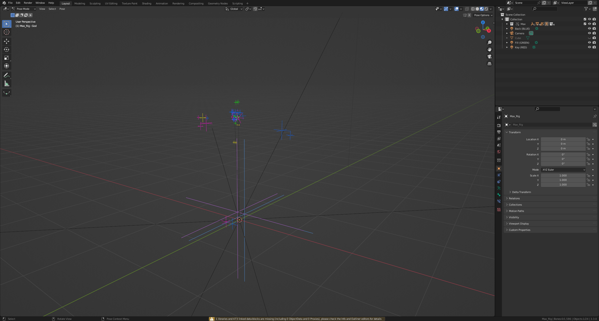

# DEV-01, Linking and Appending
### Link:[<>]
#### Tags: []

 
 

## Linking vs Appending

    Linking When you are linking, you are creating a reference from a source file
    Your actual asset is sitting outside of your current file location. Blender is
    just reading that data from the other file.

    In our current case, BaseFile Blender Project will link to the Max_Rig Blender project

    The Max object will not really be in our BaseFile scene, but the information of Max
    is being linked in from the Max_Rig blender project. Theres sort of a tether between the files.
    This is generally preferred over appending. 
    Pros for linking are this:
        It keeps your file size small. 
        Any changes in the instanced project file will be reflected on its instances.
        You can also make local changes that wont affect the original

    Therefore do what you can to set up your blender files and folders properly in advance.

    Appending does almost the exact opposite. Appending creates a local copy of the Asset
    inside of your host BaseFile scene. It does this without keeping any reference to the original file

    Major Cons for appending
        Your BaseFile scene can get super heavy
        Manually replace assets

 
 

## Trying it out (Linking)

    We have the collection but we cant enter pose mode, only Object mode.
    We need to do a library override in oder to access pose mode

    Now able to enter pose mode

 
 

## If you relocated a file and everything breaks (Linking)

    Our mesh is gone! But we can get it back

    Max is back

    Returning to View Layer

 
 

## Trying it out (Appending)

    Super easy

